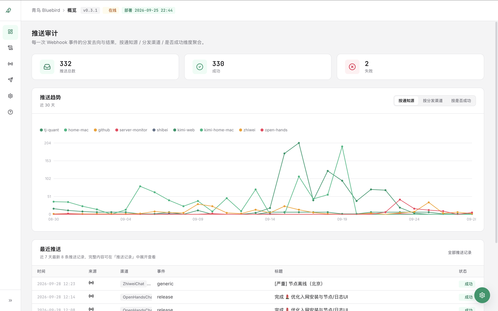
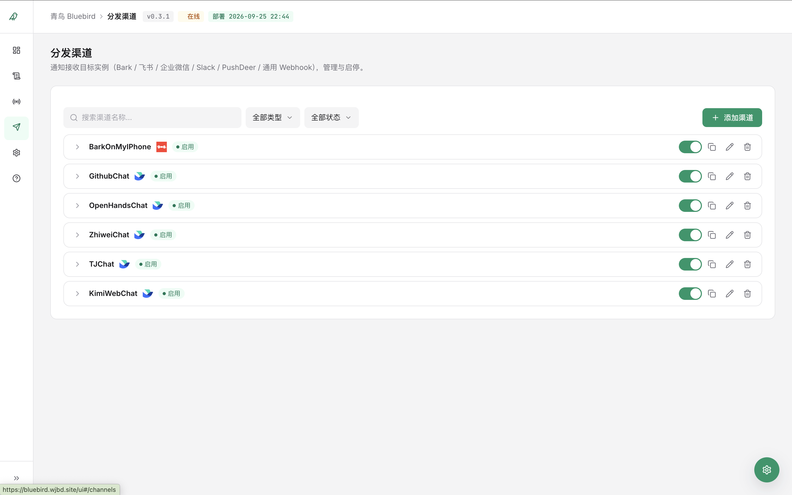
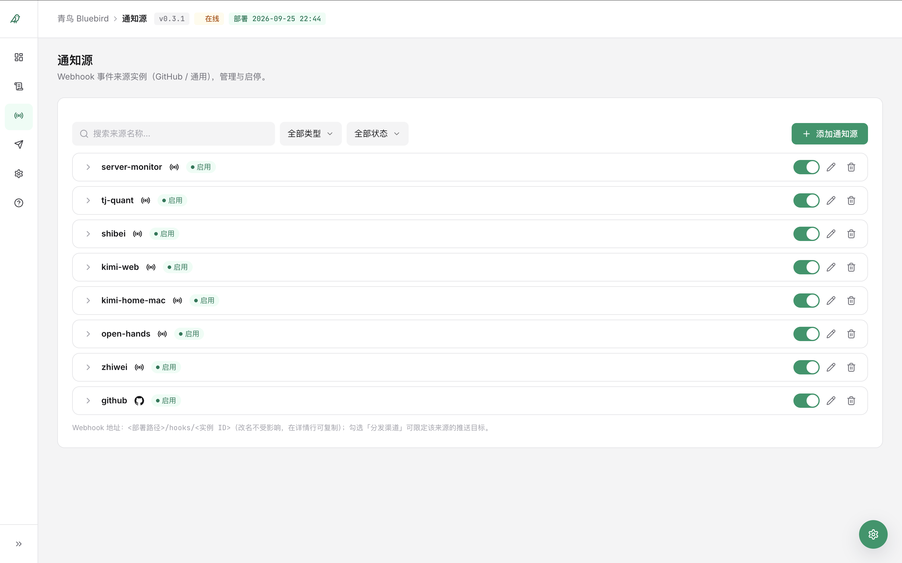
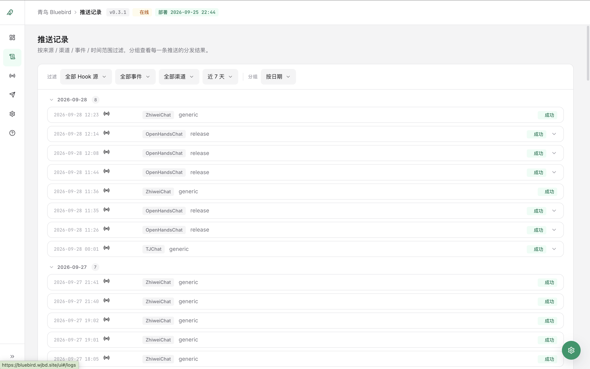
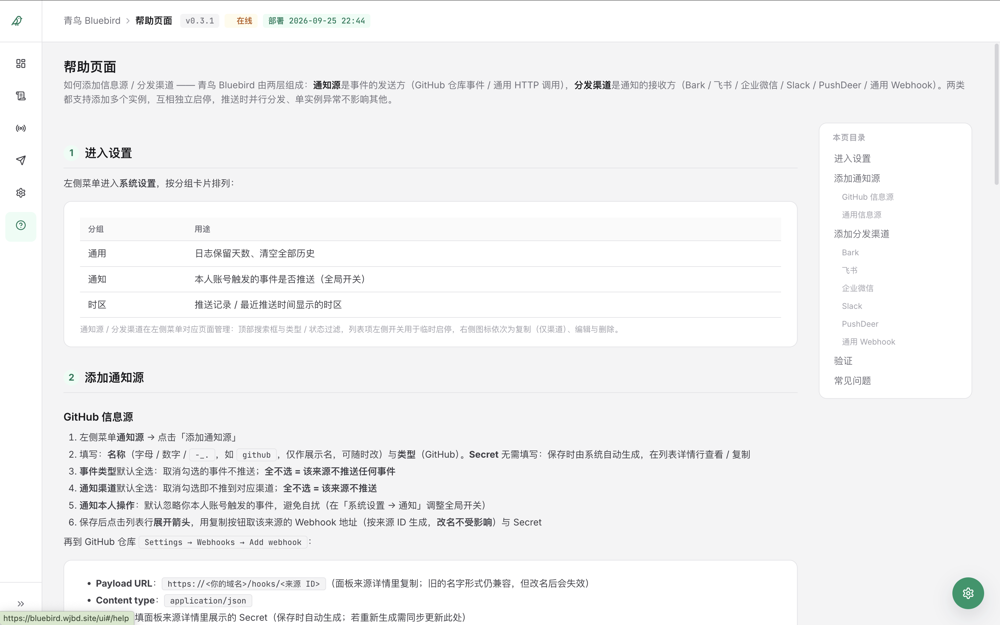
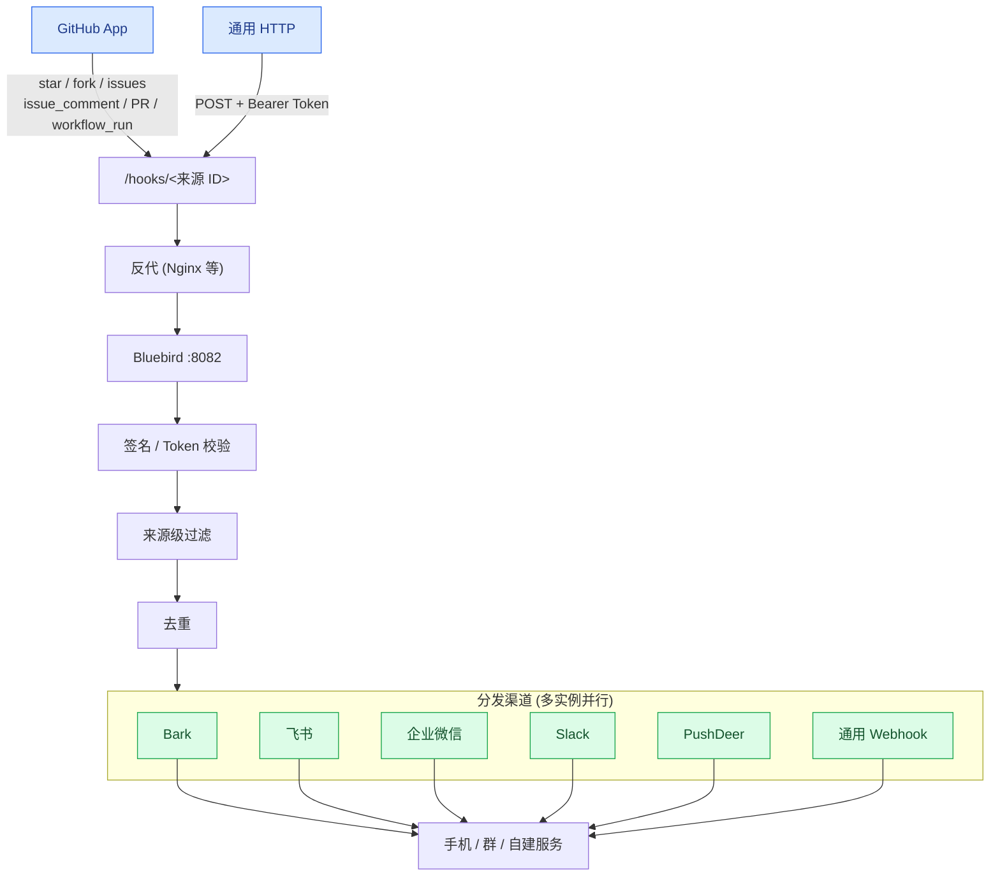

# 青鸟 Bluebird

<p align="left">
  
</p>

<p align="left">
  <a href="LICENSE"></a>
  <a href="https://github.com/hancic128/bluebird/actions/workflows/ci.yml"></a>
  <a href="https://github.com/hancic128/bluebird/actions/workflows/release.yml"></a>
  <a href="https://github.com/hancic128/bluebird/releases"></a>
  <a href="https://github.com/hancic128/bluebird/blob/main/LICENSE"></a>
</p>

**把任意应用的 Webhook（GitHub / GitLab / CI / 监控 / 自定义脚本……）一次配置，推送到 Bark / 飞书 / 企业微信 / Slack / PushDeer / 任意 Webhook。**

---

## 典型用法

> **一个 Webhook 入口，所有分发渠道。** 任意应用发一次 HTTP POST 到 Bluebird，配好的渠道（iPhone / IM 群 / 自建服务……）按需勾选并行推送。后续要临时静音、换接收人、加新渠道——面板点几下，零改脚本、零重启服务。

举两个例子：

**通用 HTTP 来源**——任何能发 POST 的应用都能用：

1. 面板「通知源」→ 添加一个「通用」类型来源 `my-scripts`，记下生成的 token
2. 你的脚本 / CI / 监控统一：
   ```bash
   curl -X POST https://你的域名/hooks/<来源 ID> \
     -H "Authorization: Bearer <token>" \
     -H "Content-Type: application/json" \
     -d '{"title":"备份完成","body":"server-01 /var backups ok","event":"backup","repo":"ops"}'
   ```
3. 已配的渠道实例（iPhone Bark / 飞书群 / Slack 频道等）一并推送
4. 临时只想推到 iPhone：进 `my-scripts` 来源详情，把其他渠道勾掉，**保存即生效**

**GitHub 仓库事件**——GitHub 是 Bluebird **内置**的一个适配层（不需要 GitHub Actions）：

1. 面板「通知源」→ 添加一个 GitHub 类型来源 `my-projects`，把面板里显示的 Webhook URL 配到 GitHub App / Webhook
2. 勾选 `Star` / `Pull request` / `Workflow run` 等事件类型；下方把已有渠道实例勾上
3. 仓库的 star / PR / CI 结果**并行**推到所有勾选渠道
4. 之后要换接收人 / 加新渠道 / 临时静音某个渠道——全部面板操作

---

## 为什么用 Bluebird？

### ✅ 适合你，如果你
- 跑自托管（NAS / VPS / 树莓派 / K8s），想要**轻量通知网关**而不引入庞大的 SaaS
- 手里有一堆**应用或脚本**（GitHub 仓库 / CI / 监控 / 备份 / 爬虫……）都想推送，不想在每个工具里硬编码 Bark / 飞书 key
- 想**集中管理多渠道**（iPhone + 飞书群 + Slack 频道），事件去重、过滤、转发一处搞定
- 关心部署成本：偏好**单文件、零依赖**而不是全家桶平台

### ❌ 不适合，如果
- 你需要 **Slack / Discord / 飞书机器人的完整交互**（slash command、按钮回调、OAuth）——Bluebird 只做单向 webhook 出站
- 你需要 **企业级 RBAC / SSO / 审计合规** ——这是单机小工具，单管理员登录
- 你想要 **100+ SaaS 集成** ——我们刻意保持渠道少而稳（新增渠道前请先开 issue 讨论）
- 你期望 SaaS 级别的 SLA —— 自托管工具，故障靠你自己

---

## 支持的信息源

Bluebird 把每个事件源抽象为「带认证的 HTTP 端点 + 字段映射 + 事件过滤」。已内置：

| 信息源 | 适配层 | 适用 |
| --- | --- | --- |
| **通用 HTTP** | 任意 `POST` + `Bearer Token`，首行标题 / 其余正文 / 或 JSON 字段 | 任何能发 HTTP 的应用 / 脚本 / CI |
| **GitHub** | GitHub App / Webhook，配 HMAC-SHA256 签名校验 + 仓库 / 事件类型 / 本人过滤 + 卡片渲染 | 仓库 star / fork / issue / PR / 评论 / CI |

`server.py` 内一个统一的 `_dispatch_<source_type>` 注册新信息源（PR 接受新类型时只需新增 ~150 行 + 表单字段）。欢迎在 issue 里讨论下一类要适配的应用（GitLab / Gitea / Drone / Jenkins / Sentry / Grafana / ……）。

## 特性一览

- **多信息源**：通用 HTTP（任意应用）+ GitHub（仓库事件适配层），均支持**多实例**
- **多渠道并行**：Bark / 飞书 / 企业微信 / Slack / PushDeer / 通用 Webhook，单渠道失败**不影响**其他
- **飞书彩色卡片**：飞书通知默认按事件类型配色（CI 失败红 / 通过绿 / Star 黄 / PR 蓝 / issue 橙 / 评论青 / fork 紫），分栏列出仓库 / 提交人 / 分支，可一键切回纯文本
- **Slack Block Kit 卡片**：Slack 渠道默认发彩色侧栏卡片，同套配色规则，可切纯文本
- **动态配置**：面板内可视化管理源 / 渠道实例（增删改、启停、搜索过滤），**改完立即生效**，无需重启
- **事件去重 + 来源级过滤** + **本人操作过滤**（避免被自己的操作刷屏）
- **统计趋势图** + **审计面板**（按日 / 按来源 / 按渠道 / 按是否成功筛选，最近 `LOG_RETENTION_DAYS` 天）
- **安全 fail-closed**：来源未配 secret / token → 401；面板未配凭据 → 503；写接口同源校验；HMAC 签名 Cookie；CSP / X-Frame-Options 等响应头齐全
- **轻量**：Python 标准库单文件，零第三方依赖

## 预览

| 概览：推送统计、趋势与最近推送 | 分发渠道：渠道实例管理 |
| :---: | :---: |
|  |  |

| 通知源：来源实例与事件类型勾选 | 推送历史：按来源 / 渠道筛选 |
| :---: | :---: |
|  |  |

| 帮助页面：面板内嵌操作指南 |
| :---: |
|  |

## 工作原理



**单条事件的旅程**：来源 → 签名校验（不通过 → 401）→ 来源级过滤（事件类型 / 本人操作 / owner）→ 去重（默认 60 秒窗）→ 分发到所勾选渠道 → 写审计 → 异步 HTTP 出站。

## 快速开始

完整文档见 [docs/README.md](docs/README.md)。下面是 4 条常用路径，任选其一：

### A. 裸 Python（最快）

```bash
git clone https://github.com/hancic128/bluebird.git
cd bluebird
cp .env.example .env       # 填写必填项（见 docs/config.md）
python3 server.py          # 浏览器开 http://127.0.0.1:8082/ui
```

### B. Docker

```bash
docker run -d --name bluebird -p 8082:8082 \
  -e WEBHOOK_SECRET=your-secret -e BARK_KEY=your-bark-key -e NOTIFY_OWNER=your-username \
  -e NOTIFY_AUTH_USER=admin -e NOTIFY_AUTH_PASS=your-password \
  -v bluebird-data:/opt/bluebird \
  ghcr.io/hancic128/bluebird
curl http://127.0.0.1:8082/health   # {"ok": true}
```

### C. Docker Compose（自建服务器推荐）

```bash
git clone https://github.com/hancic128/bluebird.git
cd bluebird
cp .env.example .env
docker compose up -d --build
curl http://127.0.0.1:8082/health   # {"ok": true}
```

含数据卷、健康检查、重启策略。

### D. 托管平台（Render / Zeabur / Railway）

从 GitHub 导入本仓库，平台自动识别 Dockerfile：

- **Render**：Health Check Path 填 `/health`；免费层磁盘临时，要持久化请挂 Persistent Disk
- **Zeabur / Railway**：挂载持久卷到 `/opt/bluebird` 即可

环境变量按 [docs/config.md](docs/config.md) 填写。详细步骤见 [docs/deploy.md](docs/deploy.md#d-托管平台render--zeabur--railway)。

---

## 文档索引

| 文档 | 内容 |
| --- | --- |
| [docs/deploy.md](docs/deploy.md) | 部署（裸 Python / Docker / Compose / 托管平台 + 反代 + 数据迁移） |
| [docs/config.md](docs/config.md) | 完整环境变量表 |
| [docs/usage.md](docs/usage.md) | 设置面板 / 统计 / 审计 / FAQ |
| [docs/sources-and-channels.md](docs/sources-and-channels.md) | 添加通知源与分发渠道的详细步骤（含 GitHub / Bark / 飞书 / 企微 / Slack / PushDeer / 通用 Webhook） |
| [docs/development.md](docs/development.md) | 开发环境、跑测试、新增渠道流程、调试技巧 |

---

## GitHub 信息源（可选）

> 通用来源不需要这部分；只要你想收 GitHub 仓库事件（star / fork / PR / CI 结果），才需要建一个 GitHub App：

1. 打开 <https://github.com/settings/apps/new>
2. `GitHub App name`：任意，如 `my-bluebird`；`Homepage URL`：你的主页
3. **Webhook URL**：面板「通知源」详情行里复制的地址（形如 `https://bluebird.example.com/hooks/<来源 ID>`；子域名根路径部署；若挂子路径则带 `/bluebird` 前缀）
4. **Webhook secret**：填 `.env` 里的 `WEBHOOK_SECRET`（`openssl rand -hex 32` 生成）
5. Repository permissions 全部 Read-only：勾 `Actions`、`Issues`、`Pull requests`
6. Subscribe to events 勾选：`Star`、`Fork`、`Issues`、`Issue comment`、`Pull request`、`Workflow run`
7. 其余默认 → Create GitHub App
8. 左侧 **Install App** → 安装到你的账号 → 选 **All repositories**（或只选部分仓库）

创建后 App 会立即发送一次 `ping` 事件，`docker logs bluebird` 可见。

---

## 安全说明

- **面板 fail-closed**：`NOTIFY_AUTH_USER` 与 `NOTIFY_AUTH_PASS` 任一为空时，面板 / API / 文档一律拒绝访问（503 并给出提示），不会静默开放——面板能读到全部渠道 key/token，必须配置凭据
- **来源 fail-closed**：GitHub 来源未配 secret、通用来源未配 token 时，`/hooks/*` 一律返回 401，不放行未认证的推送注入
- 敏感配置（Webhook secret、各渠道 key）默认从环境变量迁移后**持久化在 `bluebird.db`**（`.env` 仅首次启动读取）；数据库文件权限自动收紧为 `0600`
- 服务校验每个请求的 `X-Hub-Signature-256`（GitHub）或 `Authorization: Bearer <Token>`（通用源），伪造请求返回 401
- 登录态为 HMAC 签名 Cookie（`HttpOnly; SameSite=Lax`，经 HTTPS 反代时追加 `Secure`）；签名密钥独立于 `WEBHOOK_SECRET`，未设置时首启随机生成并落库，不可预测
- 写接口（`POST /api/settings`、`POST /login`）校验同源（`Origin`/`Referer` 与 `Host` 一致）防 CSRF；响应统一带 CSP / `X-Content-Type-Options` / `X-Frame-Options` / `Referrer-Policy`
- 单请求体默认上限 1MB（`MAX_BODY_BYTES`）、连接读写超时默认 30s（`NOTIFY_TIMEOUT`），防超大 body 与慢连接耗尽线程

漏洞报告详见 [SECURITY.md](SECURITY.md)。

## 贡献与社区

- 提 bug / 功能请求：[GitHub Issues](https://github.com/hancic128/bluebird/issues)
- 提 PR / 开发规范：[CONTRIBUTING.md](CONTRIBUTING.md)
- 漏洞私下报告：[SECURITY.md](SECURITY.md)
- 行为准则：[CODE_OF_CONDUCT.md](CODE_OF_CONDUCT.md)

## 致谢

- 界面图标来自 [Lucide](https://lucide.dev)（ISC License）
- 标志图形基于 [Phosphor Icons](https://phosphoricons.com) 的 bird 图标（MIT License）

## License

[MIT](LICENSE)